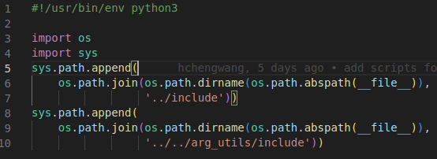

# arg_utils
## Python package mangement in ros package example
Put your python moudle into /include/for_example/ or new a folder inside include.

Add a add_path.py where your main code want to be.

Then code like this...



If you want to new a python module, just add the following code to your add_path.py
```
sys.path.append(
    os.path.join(os.path.dirname(os.path.abspath(__file__)),
                 '<path>'))
```
and make sure your < path > is pointing correctly to your python package.
