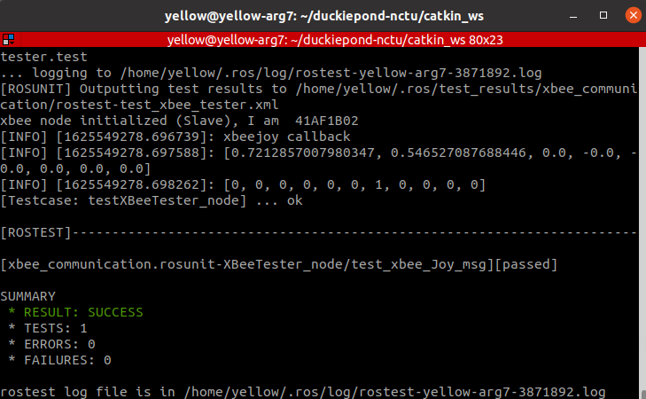

# XBee Communication
This package provides a transmission which enables the exchange of some ROS messages between multi-robot and base_station via [`Digi XBee-PRO XSC S3B Modules`](https://www.digi.com/support/productdetail?pid=5298)

Some old files have been moved to [archived](/archived/)   

## Docker
* creates a writeable container (image:[osrf/ros:melodic-desktop-full](https://hub.docker.com/r/osrf/ros/builds/?page=1))

`docker run -it --rm -v "/home:/home" --privileged osrf/ros:melodic-desktop-full bash`

* install modules

`sudo apt-get update -y`

`sudo apt-get install python3-pip -y`

`python3 -m pip install pyyaml rospkg numpy digi-xbee`

## System setting
* check port  `ls /dev/ttyUSB*`

* change mode `sudo usermod -a -G dialout <user>` or `sudo chmod 777 /dev/ttyUSB0`

## Check XBee address
[xbee_who_am_I.py](/src/xbee_who_am_I.py)

We use 64-bit source address but only the the second half

## sensor_msgs/Joy
Transmits `Joy` msg from base station to a specific robot  (one-to-one transmission)
#### How to Run (base station)
* Please edit [xbee_joy.yaml](/config/xbee_joy.yaml) about XBee address on robots
* Subscribe `input_topic (sensor_msgs/Joy)` and send data via XBee to a specific `remote_robot`

`roslaunch xbee_communication xbee_joy.launch port:="/dev/ttyUSB0" I_am_master:=true input_topic:="/joy" remote_robot:=A`
#### How to Run (robot)
* Receive XBee data from base station and publish to `output_topic (sensor_msgs/Joy)`

`roslaunch xbee_communication xbee_joy.launch port:="/dev/ttyUSB0" output_topic:="/joy" `

<!-- ## Data Packet Design
### General

the only one or the last one data packet

| Header | type | bytes | bytes | bytes | bytes | realdata | ...... | realdata | checksum |
|--------|------|-------|-------|-------|-------|----------|--------|----------|----------|

else (not the last one)

| Header | type | bytes | bytes | bytes | bytes | realdata | ...... | realdata |
|--------|------|-------|-------|-------|-------|----------|--------|----------|

### Packet Size Considerations

### SubT Coordination Data Packet

+ Header `b'\xAB'`
+ type
  + string msg `b'\x00'`
  + points `b'\x01'`
  + pose `b'\x02'`
  + goal `b'\x03'`
+ bytes `total length (bytes) of real data`

## How to Run (One to One)

TODO: should we add docker run/join commands?

## How to Run (xbee_server.py)

TODO: It is unclear why there are two how to run sections. -->

## geometry_msgs/PoseStamped & sensor_msgs/PointCloud2
Base station periodically ask robots (husky1, husky2, jackal1, jackal2 ) to return pose and points data

All msg have header with `frame_id = "map"`
#### How to Run (base station)
* Please edit [robot_xbee.yaml](/config/robot_xbee.yaml) about XBee address on robots

* Subscribe `/car_cmd (xbee_communication/Robot_PoseStamped)` and send data to robots via XBee to make them move to their goals

* Receive XBee data from robots and publish to `husky1/robot_points (sensor_msgs/PointCloud2)`, `husky1/robot_pose (geometry_msgs/PoseStamped)`, `husky2/robot_points (sensor_msgs/PointCloud2)` ......

`roslaunch xbee_communication xbee_server.launch port:="/dev/ttyUSB0" I_am_base_station:=True`

#### How to Run (robot)
* Subscribe `sub_pose (geometry_msgs/PoseStamped)` & `sub_points (sensor_msgs/PointCloud2)` and send data to base station via XBee
* Receive XBee data from base station and publish to `pub_goal (geometry_msgs/PoseStamped)`,

`roslaunch xbee_communication xbee_server.launch port:="/dev/ttyUSB0" sub_pose:="/slam_pose" sub_points:="map_part" pub_goal:="pub_goal"`

#### Data Packet Design
Packet Size is fixed (256 bytes)

the only one or the last one data packet

| Header | type | bytes | bytes | bytes | bytes | realdata | ...... | realdata | checksum |
|--------|------|-------|-------|-------|-------|----------|--------|----------|----------|

else (not the last one)

| Header | type | bytes | bytes | bytes | bytes | realdata | ...... | realdata |
|--------|------|-------|-------|-------|-------|----------|--------|----------|

+ Header `b'\xAB'`
+ type
  + string msg `b'\x00'`
  + points `b'\x01'`
  + pose `b'\x02'`
  + goal `b'\x03'`
+ bytes `total length (bytes) of real data`

#### rostest

Setup 2 XBee device on the same machine and check if each one could transfer message with the other one .

`rostest xbee_communication xbee_tester.test`

